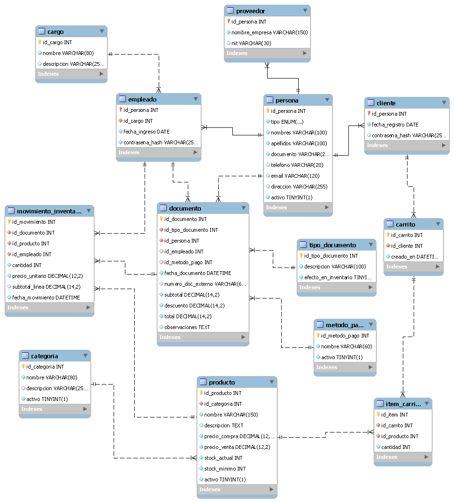

# Proyecto Integrador - Programación II

## Descripción

Sistema de gestión de ventas e inventario **TechZone** desarrollado en Java con JavaFX, siguiendo el patrón de arquitectura en capas (DAO → Services → Controller → View).

## Diagrama Entidad-Relación



## Estructura del Proyecto

```
proyecto-integrador-pii/
│
├── src/
│   └── main/
│       ├── java/
│       │   └── Proyecto/
│       │       │
│       │       ├── MainGUI.java                        # Punto de entrada (JavaFX Application)
│       │       │
│       │       ├── Model/                              # Capa de Modelos (Entidades)
│       │       │   ├── Persona.java
│       │       │   ├── Cliente.java
│       │       │   ├── Empleado.java
│       │       │   ├── Proveedor.java
│       │       │   ├── Cargo.java
│       │       │   ├── Producto.java
│       │       │   ├── Categoria.java
│       │       │   ├── Carrito.java
│       │       │   ├── ItemCarrito.java
│       │       │   ├── Documento.java
│       │       │   ├── TipoDocumento.java
│       │       │   ├── MetodoPago.java
│       │       │   ├── MovimientoInventario.java
│       │       │   ├── Inventario.java
│       │       │   ├── Venta.java
│       │       │   ├── Compra.java
│       │       │   ├── DetalleCompra.java
│       │       │   └── Alerta.java
│       │       │
│       │       ├── dao/                                # Capa de Acceso a Datos (DAO)
│       │       │   ├── PersonaDAO.java
│       │       │   ├── ProductoDAO.java
│       │       │   ├── CategoriaDAO.java
│       │       │   ├── CarritoDAO.java
│       │       │   ├── ItemCarritoDAO.java
│       │       │   ├── DocumentoDAO.java
│       │       │   └── InventarioDAO.java
│       │       │
│       │       ├── services/                           # Capa de Servicios (Lógica de Negocio)
│       │       │   ├── PersonaServices.java
│       │       │   ├── ProductoServices.java
│       │       │   ├── CategoriaServices.java
│       │       │   ├── CarritoServices.java
│       │       │   ├── ItemCarritoServices.java
│       │       │   ├── DocumentoServices.java
│       │       │   └── InventarioServices.java
│       │       │
│       │       ├── Controller/                         # Capa de Controladores (MVC)
│       │       │   ├── UsuarioController.java
│       │       │   ├── ProductoController.java
│       │       │   ├── CarritoController.java
│       │       │   ├── DocumentoController.java
│       │       │   └── InventarioController.java
│       │       │
│       │       ├── View/                               # Capa de Vistas (JavaFX UI)
│       │       │   ├── ViewGUI.java
│       │       │   ├── usuario/
│       │       │   │   ├── LoginView.java              # Pantalla de inicio de sesión
│       │       │   │   └── MenuPrincipalView.java      # Menú principal
│       │       │   ├── Producto/
│       │       │   │   ├── ProductoView.java           # Listado de productos
│       │       │   │   └── ProductoFormView.java       # Formulario crear/editar producto
│       │       │   ├── Carrito/
│       │       │   │   └── CarritoView.java            # Carrito de compras
│       │       │   ├── Documento/
│       │       │   │   ├── RegistroVentasView.java     # Historial de ventas
│       │       │   │   └── RegistroCompraView.java     # Historial de compras
│       │       │   └── Inventario/
│       │       │       └── MovimientosView.java        # Movimientos de inventario
│       │       │
│       │       └── util/                               # Utilidades
│       │           ├── conexionBD.java                 # Conexión a MySQL
│       │           ├── conexionApp.java
│       │           ├── Alerta.java
│       │           └── AlertaHelper.java
│       │
│       └── resources/
│           └── logo.jpg                               # Logo de la aplicación
│
├── Techzone.sql                                       # Script de base de datos MySQL
├── MER.png                                            # Diagrama Entidad-Relación
├── config.properties                                  # Configuración de conexión a BD
└── pom.xml                                            # Configuración Maven
```

## Arquitectura por Capas

```
Vista (JavaFX UI)
      ↓
Controlador (MVC)
      ↓
Services (Lógica de negocio)
      ↓
DAO (Acceso a datos)
      ↓
Base de Datos MySQL (Techzone)
```

## Tecnologías Utilizadas

- **Java 21**
- **JavaFX 21.0.2** — Interfaz gráfica
- **Maven** — Gestión de dependencias
- **MySQL** — Base de datos
- **MySQL Connector/J 8.3.0** — Driver JDBC
- **Patrón MVC** — Arquitectura

## Configuración de Base de Datos

El archivo `config.properties` contiene los datos de conexión:

```properties
db.host=localhost
db.port=3306
db.name=Techzone
db.user=root
db.password=tu_contraseña
```

## Cómo Ejecutar

```bash
# Compilar el proyecto
mvn clean compile

# Ejecutar la aplicación
mvn javafx:run
```

## Usuarios de Prueba

| Email | Contraseña |
|---|---|
| laura@gmail.com | laura123 |
| admin@techzone.co | techzone |

## Autor

Juanes
Alan Caicedo